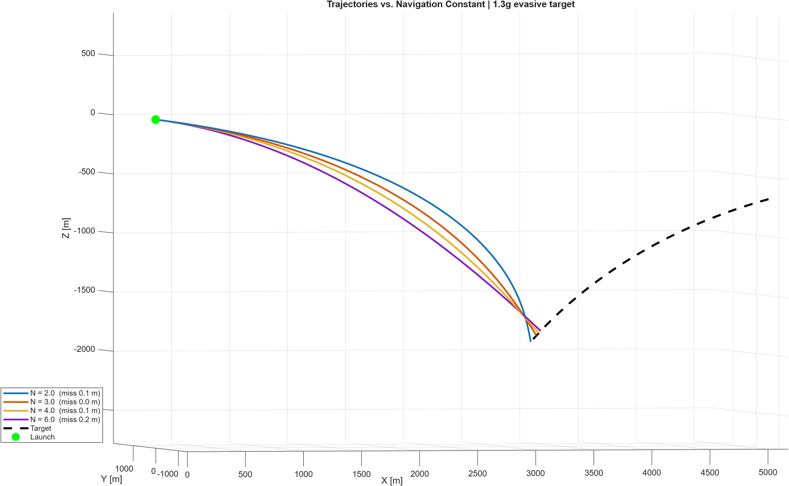
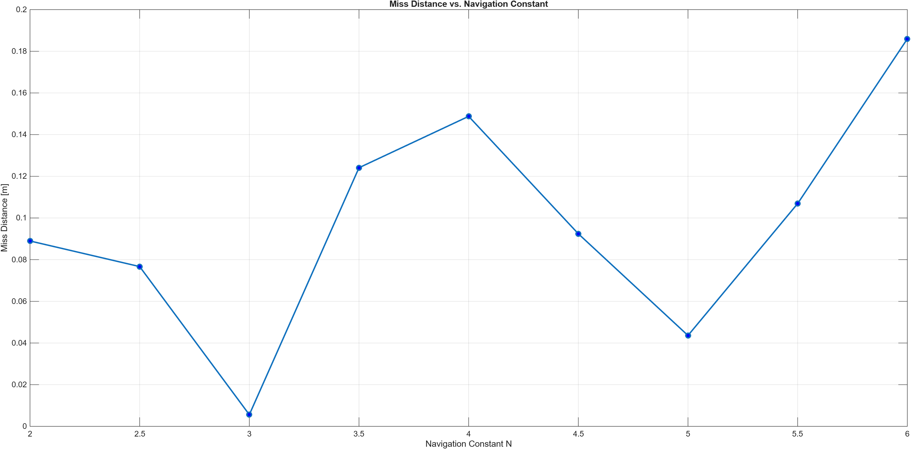

# Missile Intercept Simulation

3-DOF missile intercept simulation in MATLAB using proportional navigation (PN) guidance, with navigation-constant sweep and trajectory analysis against a maneuvering target.

## Overview

Simulates a missile intercepting an evasive airborne target in three dimensions. Engagement geometry is randomized each run — target range, bearing, speed, and evasive turn rate — so the guidance law is tested across a wide variety of scenarios rather than one hand-tuned case.

## The guidance principle

Proportional navigation is built on a single geometric fact: **if the line of sight to a target holds a constant angle while the range closes, the two objects are on a collision course.** It is the same rule a driver uses at an intersection — a car that stays frozen in the same spot in your window while growing larger is going to hit you.

The missile exploits this deliberately. Each time step it measures how fast the line of sight is *rotating* and commands an acceleration proportional to that rotation rate, applied perpendicular to its own velocity:

Where `Omega` is the line-of-sight rotation rate, `v_m` is missile velocity, and `N` is the navigation constant. Because the command is perpendicular to velocity, it turns the missile without changing its speed — matching how a fin-controlled missile actually steers.

## Results

Sweeping the navigation constant against a 3g evasive target produces a clear performance knee:

| N | Miss distance |
|---|---------------|
| 2.0 | ~176 m |
| 2.5 | ~108 m |
| 3.0 | ~49 m |
| 3.5 | ~1 m |
| 4.0 – 6.0 | < 1 m |

Below N = 3 the missile responds too slowly to the target's maneuver and the sight-line error accumulates faster than it can correct. Above N ≈ 3.5 miss distance flattens out, and additional gain buys no accuracy. This matches the N = 3–5 range used in fielded systems.

Numerical accuracy was verified by refining the integration step: reducing `dt` by 10x reduced miss distance by approximately 10x, confirming first-order convergence consistent with Euler integration and showing the residual error is numerical rather than a guidance limitation.

## Figures

*Missile trajectories at N = 2, 3, 4, 6 against the same evasive target. Higher gain produces a larger lead angle — the missile aims where the target will be rather than where it is.*

*Miss distance versus navigation constant, showing the performance knee near N = 3.5.*

## Running it

Requires MATLAB (no additional toolboxes).

Uncomment the `rng(...)` line at the top of the script to reproduce a specific engagement.

## Model assumptions

- **3-DOF** — translational motion only; no pitch, roll, yaw, fin dynamics, or autopilot lag
- **Constant missile speed** — guidance changes direction only; no thrust, drag, or gravity
- **Perfect sensing** — no seeker noise, update lag, or loss of lock
- **No acceleration limits** — the airframe is assumed able to deliver any commanded acceleration, which is why high N shows no penalty here; in reality control saturation and noise amplification cap N on the high end

## Author

Tristan Burnett — Electrical Engineering & Computer Science, University of Arkansas
