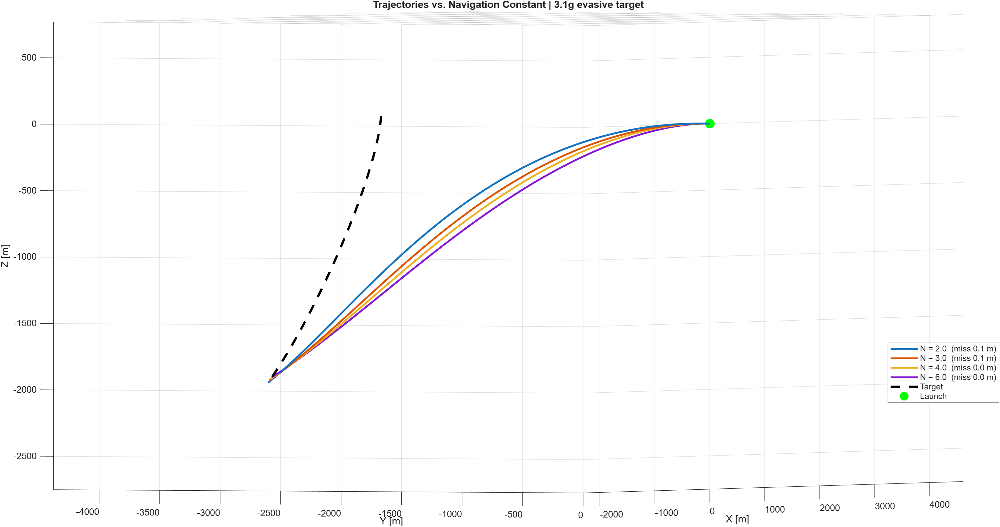
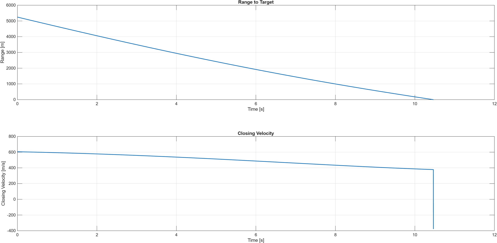

# Missile Intercept Simulation

3-DOF missile intercept simulation in MATLAB using proportional navigation (PN) guidance, with navigation-constant sweep and trajectory analysis against a maneuvering target.

## Overview

Simulates a missile intercepting an evasive airborne target in three dimensions. The engagement geometry is randomized on each run — target range, bearing, speed, and evasive turn rate — so the guidance law is tested across many scenarios rather than one hand-tuned case.

## The guidance principle

Proportional navigation is built on a single geometric fact: **if the line of sight to a target holds a constant angle while the range closes, the two objects are on a collision course.** It is the same rule a driver uses at an intersection — a car that stays frozen in the same spot in your window while growing larger is going to hit you.

The missile exploits this deliberately. Each time step it measures how fast the line of sight is *rotating* and commands an acceleration proportional to that rotation rate, applied perpendicular to its own velocity. Because the command is perpendicular to velocity, it turns the missile without changing its speed — matching how a fin-controlled missile actually steers. N is the navigation constant, the gain that sets how aggressively the missile responds to line-of-sight drift.

## Results

Representative engagement:

| Parameter | Value |
|---|---|
| Target start position | [5172, -538, -683] m |
| Initial range | 5,244 m |
| Target velocity | [-204, 119, -64] m/s (245 m/s) |
| Target evasive turn | 1.3 g |
| Initial closing velocity | ~600 m/s |
| Time to intercept | ~10.5 s |

Navigation constant sweep:

| N | Miss distance |
|---|---------------|
| 2.0 | 0.09 m |
| 2.5 | 0.08 m |
| 3.0 | 0.01 m |
| 3.5 | 0.12 m |
| 4.0 | 0.15 m |
| 4.5 | 0.09 m |
| 5.0 | 0.04 m |
| 5.5 | 0.11 m |
| 6.0 | 0.19 m |

The missile intercepted successfully at every gain tested, with all miss distances below 0.2 m and no consistent trend across N.

This outcome is numerical rather than physical. With a 1 ms integration step and a 400 m/s missile closing at roughly 600 m/s, the simulation advances about 0.6 m of range per step — larger than every miss distance measured. The scatter in the table is integration-step resolution, not guidance performance. Refining the time step by a factor of 10 reduces miss distance by approximately the same factor, consistent with the first-order accuracy of Euler integration and confirming the residual is numerical error.

The practical conclusion is that against a lightly maneuvering target, proportional navigation is insensitive to gain selection across the entire 2-6 range: the guidance law drives the line-of-sight rate to zero and converges to a collision course regardless of how aggressively it is tuned. Gain selection only becomes performance-limiting when the target maneuvers hard enough that the missile's turn rate, rather than the guidance geometry, becomes the constraint.

The trajectory comparison shows the effect the gain does have. Higher N produces a larger lead angle — the missile commits earlier to an intercept point ahead of the target rather than tracking its current position — visible as a progressively tighter turn from N = 2 through N = 6, even though all four reach the target.

## Figures

*Single engagement at N = 4 against a 1.3g evasive target. Green marks launch, the star marks intercept.*

*Range decreases nearly linearly to zero over roughly 10.5 s. Closing velocity starts near 600 m/s and decays as the geometry changes, then reverses sharply at the moment of closest approach.*

*Missile trajectories at N = 2, 3, 4, and 6 against the same target. Higher gain produces a larger lead angle and a tighter path.*

*Miss distance across the navigation constant sweep. All values fall below the simulation's per-step resolution, so the variation reflects numerical noise rather than guidance performance.*

## Running it

Requires MATLAB. No additional toolboxes.

Run missile_intercept.m directly. Each run generates a new random engagement. Uncomment the rng(...) line at the top of the script to reproduce a specific one.

## Model assumptions

- **3-DOF** — translational motion only; no pitch, roll, yaw, fin dynamics, or autopilot lag
- **Constant missile speed** — guidance changes direction only; no thrust, drag, or gravity modeled
- **Perfect sensing** — no seeker noise, update lag, or loss of lock
- **No acceleration limits** — the airframe is assumed capable of any commanded acceleration. This is why high N shows no penalty here; in reality, control saturation and noise amplification are what cap N on the high end
- **Euler integration** — first-order accurate, verified by step-refinement convergence

## Possible extensions

- Monte Carlo sweep across many random engagements to characterize gain sensitivity statistically
- Acceleration limiting to model realistic airframe constraints
- Augmented proportional navigation with a target-acceleration term
- Seeker noise and measurement lag

## Author

Tristan Burnett — Electrical Engineering & Computer Science, University of Arkansas
